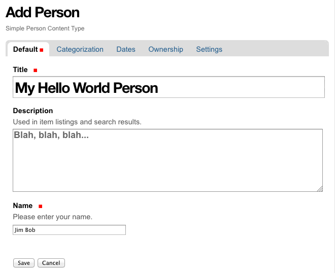
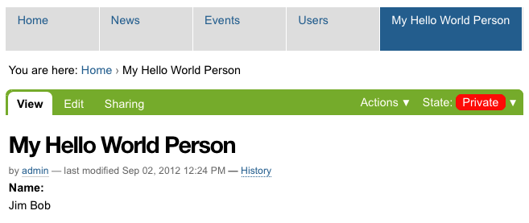

===================
Add a content-type
===================

.. admonition:: Description

A simple tutorial introducing the basics of Plone development.

.. contents:: :local:

In this tutorial we add a custom content-type.

Plone comes with built-in content-types like Collection, Event, File, Folder, Image, Link, News Item, and Page. If you need a custom content-type, you can extend an existing content-type, or create your own from scratch. In this example, we'll create a simple archetypes based content-type from scratch. 

Install code template with ZopeSkel
====================================

- First, we'll change our working directory to the project we created above.::

     # from your buildout directory
     cd src/example.helloworld

- Use paster to create a content-type skeleton. Paster is included with ZopeSkel.::

    ../../../bin/paster addcontent contenttype
    
- Again, you'll be asked a series of questions. Use *Person* for the contenttype_name.::

    Enter contenttype_name (Content type name ) ['Example Type']: Person
    Enter contenttype_description (Content type description ) ['Description of the Example Type']: Simple Person Content Type
    Enter folderish (True/False: Content type is Folderish ) [False]: 
    Enter global_allow (True/False: Globally addable ) [True]: 
    Enter allow_discussion (True/False: Allow discussion ) [False]: 
    
This creates a few files, and edits some others. For our purposes, the most important one is **person.py** contained in the **src/example.helloworld/example/helloworld/content/** directory. Open this file in your text editor.

Extend the content-type
========================

Edit PersonSchema inside *person.py* so it looks like this.::

    PersonSchema = schemata.ATContentTypeSchema.copy() + atapi.Schema((
    
        # -*- Your Archetypes field definitions here ... -*-
        atapi.StringField(
            name='hello_name',
            required=True,
            widget=atapi.StringWidget(
                label='Name', 
                description='Please enter your name.', 
                visible= {'view': 'visible', 'edit': 'visible'},
            ),
        ),
    
        atapi.StringField(
            name='hello_number',
            required=False,
            widget=atapi.StringWidget(
                label='Number', 
                description='Please give us your number.', 
                visible= {'view': 'visible', 'edit': 'visible'},
            ),
        ),
    
        atapi.BooleanField(
            name='available',
            required=False,
            default=True,
            widget=atapi.BooleanWidget(
                label='Available?', 
                description='Are you available?', 
                format='checkbox',
            ),
        ),
        
        atapi.TextField(
            name='hello_notes',
            required=False,
            widget=atapi.TextAreaWidget(
                label='Notes', 
                description='General purpose notes area.',
                rows=10,
                visible= {'view': 'visible', 'edit': 'visible'},
            ),
        ),
    
    ))
    
    
This adds a few fields to our schema, including a string attribute named **hello_name**. It is required, and is visible on both the view and edit pages.

Restart your instance to have access to the new content-type.::

    # from your buildout directory
    ./bin/instance restart

Add content to the site
========================
    
To create a new object using the new content-type, select *HelloWorld* from the *Add new...* menu of your Plone site. This brings up the *edit* view.

Fill in the fields and click *Save*. This brings up the *view* view.

You should see an *info* message telling you your changes were saved, and a new tab in the navigation bar with the title of your object. 

Notice the **State** menu on the right hand side of the green bar. It tells you your content is **Private**, meaning only you can see it. You need to select **Publish** from the *State* menu.

Also notice the url of the page. It is based on the Title of the object, with two main differences. The letters are all lower case, and spaces are turned into dashes. 

For more information about content in Plone, see the :doc:`Content management </content/index>` section of this manual. For more information about content types, see :doc:`Content Types </content/types>`.
    
