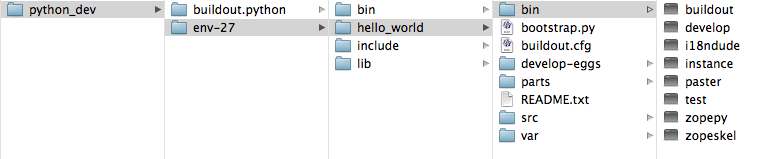

==============================
Build development environment
==============================

.. admonition:: Description

Build a reusable Python development environment, and install Plone 4.2 within a Python 2.7 virtual_env. 

.. contents :: :local:

In this tutorial, we build a Python development environment suitable for Plone. The environment should be useful for any other Python development projects you have.

In these examples, the **python_dev** directory contains our entire development environment. This makes the examples easier, but may not work for everyone. You may need to adapt these examples to fit your situation.

There are 3 main steps in building our development environment; build Python 2.7, create a virtual_env, and install Plone. These correspond to 3 directories in our development environment:

- **buildout.python** sits inside *python_dev*. It contains our build of Python 2.7
- **env-27** sits inside *python_dev*. It is our virtual_env. 
- **hello_world** is our Plone installation. It sits inside *env-27*.

The *python_dev* directory can sit anywhere on your filesystem that makes sense. 

-------------
Build Python
-------------

The first thing we need to do is build Python. 

Buildout is a tool to manage a software build. It uses configurations so you can always reproduce the same environment. We will use it to manage both our Python and Plone builds. 

For building Python, we will use buildout.python for our buildout configuration. It is a project on github that maintains configurations for building different versions of Python. We will use it to build Python 2.7.

- Create a directory for your development environment if you don't already have one, and make it your working directory.::

    mkdir python_dev
    cd python_dev

- Get buildout.python from github. 

    - If you have git, you can clone the buildout.python repository.::
    
        git clone https://github.com/collective/buildout.python.git buildout.python
    
    - You can also download buildout.python from their web interface. Open https://github.com/collective/buildout.python in your browser, and click on the **Downloads** link on the right hand side.
    
        .. image:: images/buildout.python-web.png
    
        On the next page, click on **Download as zip** or **Download as tar.gz** to download the buildout files. When the download is complete, uncompress the file and rename the resulting directory to **buildout.python**.
    
    Whether you cloned with git or downloaded from the webiste, you should end up with a directory named **buildout.python** that contains these items.::
    
        [michaelc@Cullerton python_dev]$ ll buildout.python
        total 56
        -rw-r--r--   1 michaelc  staff   1895 Aug 25 12:28 README.rst
        -rw-r--r--   1 michaelc  staff   4122 Aug 25 12:28 bootstrap-1.4.4.py
        -rw-r--r--   1 michaelc  staff  10107 Aug 25 12:28 bootstrap.py
        -rw-r--r--   1 michaelc  staff    815 Aug 25 12:28 buildout.cfg
        drwxr-xr-x   6 michaelc  staff    204 Aug 25 12:28 docs
        drwxr-xr-x  30 michaelc  staff   1020 Aug 25 12:28 src

    
- Bootstrap buildout.python with your system Python.:: 

    cd buildout.python
    python bootstrap.py
    
    
This creates the *bin*, *parts*, *eggs*, and *develop-eggs* directories and adds the *buildout* binary to the bin directory.::
    
    [michaelc@Cullerton buildout.python]$ ll
    total 56
    -rw-r--r--   1 michaelc  staff   1895 Aug 25 13:31 README.rst
    drwxr-xr-x   3 michaelc  staff    102 Aug 25 13:32 bin
    -rw-r--r--   1 michaelc  staff   4122 Aug 25 13:31 bootstrap-1.4.4.py
    -rw-r--r--   1 michaelc  staff  10107 Aug 25 13:31 bootstrap.py
    -rw-r--r--   1 michaelc  staff    815 Aug 25 13:31 buildout.cfg
    drwxr-xr-x   2 michaelc  staff     68 Aug 25 13:32 develop-eggs
    drwxr-xr-x   6 michaelc  staff    204 Aug 25 13:31 docs
    drwxr-xr-x   4 michaelc  staff    136 Aug 25 13:32 eggs
    drwxr-xr-x   2 michaelc  staff     68 Aug 25 13:32 parts
    drwxr-xr-x  30 michaelc  staff   1020 Aug 25 13:31 src

    [michaelc@Cullerton buildout.python]$ ll bin
    total 8
    -rwxr-xr-x  1 michaelc  staff  301 Aug 25 13:32 buildout
    
The current version of buildout.python builds Python 2.4, 2.5, 2.6, 2.7, 3.2 and 3.3. This can take a long time. We only need Python 2.7. To save some time we will only build Python 2.7. 

- To only build Python 2.7, open the **buildout.cfg** file in a text editor,  comment out the other versions in both extends and parts sections, and save your changes.::
    
    [buildout]
    extends =
        src/base.cfg
        src/readline.cfg
        src/libjpeg.cfg
    #     src/python24.cfg
    #     src/python25.cfg
    #     src/python26.cfg
        src/python27.cfg
    #     src/python32.cfg
    #     src/python33.cfg
        src/links.cfg
    
    parts =
        ${buildout:base-parts}
        ${buildout:readline-parts}
        ${buildout:libjpeg-parts}
    #     ${buildout:python24-parts}
    #     ${buildout:python25-parts}
    #     ${buildout:python26-parts}
        ${buildout:python27-parts}
    #     ${buildout:python32-parts}
    #     ${buildout:python33-parts}
        ${buildout:links-parts}
        
    
- Run buildout to build Python.::

    ./bin/buildout
        
This creates a new python-2.7 directory containing it's own binaries, libraries and include files.::
    
    
    [michaelc@Cullerton buildout.python]$ ll
    total 56
    -rw-r--r--   1 michaelc  staff   1895 Aug 25 12:28 README.rst
    drwxr-xr-x   5 michaelc  staff    170 Aug 25 12:44 bin
    -rw-r--r--   1 michaelc  staff   4122 Aug 25 12:28 bootstrap-1.4.4.py
    -rw-r--r--   1 michaelc  staff  10107 Aug 25 12:28 bootstrap.py
    -rw-r--r--@  1 michaelc  staff    835 Aug 25 12:31 buildout.cfg
    drwxr-xr-x   3 michaelc  staff    102 Aug 25 12:30 develop-eggs
    drwxr-xr-x   6 michaelc  staff    204 Aug 25 12:28 docs
    drwxr-xr-x  12 michaelc  staff    408 Aug 25 12:41 eggs
    drwxr-xr-x  10 michaelc  staff    340 Aug 25 12:44 parts
    drwxr-xr-x   5 michaelc  staff    170 Aug 25 12:44 python-2.7
    drwxr-xr-x  32 michaelc  staff   1088 Aug 25 12:44 src

    [michaelc@Cullerton buildout.python]$ ll python-2.7/
    total 0
    drwxr-xr-x  17 michaelc  staff  578 Aug 25 12:44 bin
    drwxr-xr-x   7 michaelc  staff  238 Aug 25 12:44 include
    drwxr-xr-x  11 michaelc  staff  374 Aug 25 12:44 lib

    [michaelc@Cullerton buildout.python]$ ll python-2.7/bin/
    total 8184
    -rw-r--r--  1 michaelc  staff     2228 Aug 25 12:44 activate
    -rw-r--r--  1 michaelc  staff     1115 Aug 25 12:44 activate.csh
    -rw-r--r--  1 michaelc  staff     2423 Aug 25 12:44 activate.fish
    -rw-r--r--  1 michaelc  staff     1129 Aug 25 12:44 activate_this.py
    -rwxr-xr-x  1 michaelc  staff      369 Aug 25 12:44 easy_install
    -rwxr-xr-x  1 michaelc  staff      377 Aug 25 12:44 easy_install-2.7
    -rwxr-xr-x  1 michaelc  staff      230 Aug 25 12:44 pilconvert.py
    -rwxr-xr-x  1 michaelc  staff      228 Aug 25 12:44 pildriver.py
    -rwxr-xr-x  1 michaelc  staff      224 Aug 25 12:44 pilfile.py
    -rwxr-xr-x  1 michaelc  staff      224 Aug 25 12:44 pilfont.py
    -rwxr-xr-x  1 michaelc  staff      226 Aug 25 12:44 pilprint.py
    -rwxr-xr-x  1 michaelc  staff      321 Aug 25 12:44 pip
    -rwxr-xr-x  1 michaelc  staff      329 Aug 25 12:44 pip-2.7
    -rwxr-xr-x  1 michaelc  staff  2065616 Aug 25 12:44 python
    -rwxr-xr-x  1 michaelc  staff  2065616 Aug 25 12:44 python2.7
    
    
Buildout also creates the **virtualenv-2.7** script in the bin directory. We will use the *virtualenv-2.7* script in the next tutorial.::

    [michaelc@Cullerton buildout.python]$ ll bin
    total 24
    -rwxr-xr-x  1 michaelc  staff  296 Aug 25 12:41 buildout
    -rwxr-xr-x  1 michaelc  staff  609 Aug 25 12:44 install-links
    -rwxr-xr-x  1 michaelc  staff  155 Aug 25 12:44 virtualenv-2.7

.. Note::

    You can build any of the other versions of Python by uncommenting their lines in the *buidout.cfg* file,::
    
        [buildout]
        extends =
            src/base.cfg
            src/readline.cfg
            src/libjpeg.cfg
            src/python24.cfg
            src/python25.cfg
            src/python26.cfg
            src/python27.cfg
            src/python32.cfg
            src/python33.cfg
            src/links.cfg
        
        parts =
            ${buildout:base-parts}
            ${buildout:readline-parts}
            ${buildout:libjpeg-parts}
            ${buildout:python24-parts}
            ${buildout:python25-parts}
            ${buildout:python26-parts}
            ${buildout:python27-parts}
            ${buildout:python32-parts}
            ${buildout:python33-parts}
            ${buildout:links-parts}
    
    and rerunning buildout.::

        ./bin/buildout
        
    It just takes a while.
        

.. Note::

    If you have trouble running buildout, you may need to run the bootstrap step above with the 1.4.4 version.::
    
        python bootstrap-1.4.4.py
        ./bin/buildout
    

--------------------
Create a virtual_env
--------------------

Now that we have a clean install of Python 2.7 we can move on to the second step in our process, creating the virtual_env.

- Use the virtualenv script from the Build Python section above, create our virtual_env directory.::

    # change your working directory to python_dev
    cd ..
    ./buildout.python/bin/virtualenv-2.7 env-27
        
This creates the env-27 directory.::

    [michaelc@Cullerton python_dev]$ ll
    total 0
    drwxr-xr-x  16 michaelc  staff  544 Aug 25 20:27 buildout.python
    drwxr-xr-x   5 michaelc  staff  170 Aug 25 20:39 env-27

The virtual_env has its own Python bin, include and lib directories.::

    [michaelc@Cullerton python_dev]$ ll env-27/
    total 0
    drwxr-xr-x  12 michaelc  staff  408 Aug 25 20:39 bin
    drwxr-xr-x   3 michaelc  staff  102 Aug 25 20:39 include
    drwxr-xr-x   3 michaelc  staff  102 Aug 25 20:39 lib

In the bin directory, the virtual_env has 2 copies of Python 2.7; **python** and **python2.7**. It also has easy_install and pip, to install Python packages.::
    
    [michaelc@Cullerton python_dev]$ ll env-27/bin/
    total 8144
    -rw-r--r--  1 michaelc  staff     2227 Aug 25 20:39 activate
    -rw-r--r--  1 michaelc  staff     1114 Aug 25 20:39 activate.csh
    -rw-r--r--  1 michaelc  staff     2422 Aug 25 20:39 activate.fish
    -rw-r--r--  1 michaelc  staff     1129 Aug 25 20:39 activate_this.py
    -rwxr-xr-x  1 michaelc  staff      368 Aug 25 20:39 easy_install
    -rwxr-xr-x  1 michaelc  staff      376 Aug 25 20:39 easy_install-2.7
    -rwxr-xr-x  1 michaelc  staff      320 Aug 25 20:39 pip
    -rwxr-xr-x  1 michaelc  staff      328 Aug 25 20:39 pip-2.7
    -rwxr-xr-x  1 michaelc  staff  2065616 Aug 25 20:39 python
    -rwxr-xr-x  1 michaelc  staff  2065616 Aug 25 20:39 python2.7
    
.. Note::
    
    The bin directory also has an **activate** script you can use to isolate your commands within your virtual_env. It modifies your $PATH so its first entry is the virtualenv's bin/ directory

.. Note::

    Now that we have our virtual_env, we won't use *buildout.python* again for these examples. However, you can return there later to create new virtual environments for other Python projects.::
    
        # from the **python_dev** directory
        ./buildout.python/bin/virtualenv-2.7 some_other_env-27
         
    You can also build the versions of Python that we skipped in the Build Python section above, and then use them to build new Python virtual_envs.::

         # from the **python_dev** directory
         ./buildout.python/bin/virtualenv-3.2 some_env-32

For more information about virtualenv, see the `virtualenv documentation <http://www.virtualenv.org/en/latest/index.html>`_ .

-------------
Install Plone
-------------

Now that we have a virtual_env, we can move on the to third step of our process; installing Plone. First, we need to install ZopeSkel.

Install ZopeSkel
-----------------

ZopeSkel simplifies the process of setting up Plone development. 

The Plone community is transitioning between ZopeSkel 2.21.2 and a major rewrite currently at 3.0b3. Currently, the Plone installers use version 2.21.2. (August 2012) For more information about ZopeSkel see the :doc:`Bootstrapping Plone add-on development </getstarted/paste>` section of this manual.

We will install ZopeSkel 2.21.2 in our virtual_env and and use it to install Plone. 
    
- Install ZopeSkel 2.21.2.::
    
    # change your working directory to the virtual_env
    cd env-27
    ./bin/easy_install -U ZopeSkel==2.21.2
    
This adds some files to the bin directory, including **zopeskel**.::

    [michaelc@Cullerton env-27]$ ll bin/
    total 8176
    -rw-r--r--  1 michaelc  staff     2227 Aug 25 20:39 activate
    -rw-r--r--  1 michaelc  staff     1114 Aug 25 20:39 activate.csh
    -rw-r--r--  1 michaelc  staff     2422 Aug 25 20:39 activate.fish
    -rw-r--r--  1 michaelc  staff     1129 Aug 25 20:39 activate_this.py
    -rwxr-xr-x  1 michaelc  staff      220 Aug 25 21:02 cheetah
    -rwxr-xr-x  1 michaelc  staff      236 Aug 25 21:02 cheetah-compile
    -rwxr-xr-x  1 michaelc  staff      368 Aug 25 20:39 easy_install
    -rwxr-xr-x  1 michaelc  staff      376 Aug 25 20:39 easy_install-2.7
    -rwxr-xr-x  1 michaelc  staff      356 Aug 25 21:02 paster
    -rwxr-xr-x  1 michaelc  staff      320 Aug 25 20:39 pip
    -rwxr-xr-x  1 michaelc  staff      328 Aug 25 20:39 pip-2.7
    -rwxr-xr-x  1 michaelc  staff  2065616 Aug 25 20:39 python
    -rwxr-xr-x  1 michaelc  staff  2065616 Aug 25 20:39 python2.7
    -rwxr-xr-x  1 michaelc  staff      354 Aug 25 21:02 zopeskel

Install Plone using ZopeSkel
-----------------------------

ZopeSkel uses templates to build structure for Python, Zope and Plone projects. Here, we use the **plone4_buildout** template to create a Plone 4 buildout in the **hello_world** directory.
    
- Create the Plone 4 buildout with zopeskel.::

    ./bin/zopeskel plone4_buildout hello_world
        
ZopeSkel displays some information and then asks what version of Plone we want to install. We want 4.2.::
    
        Plone Version (Plone version # to install) ['4.1']: 4.2            

The tutorial sometimes refers to the hello_world directory as the **buildout directory**. It contains the **buildout.cfg** file.::
    
    [michaelc@Cullerton env-27]$ ll
    total 0
    drwxr-xr-x  16 michaelc  staff  544 Aug 25 21:02 bin
    drwxr-xr-x   7 michaelc  staff  238 Aug 25 21:25 hello_world
    drwxr-xr-x   3 michaelc  staff  102 Aug 25 20:39 include
    drwxr-xr-x   3 michaelc  staff  102 Aug 25 20:39 lib    

    [michaelc@Cullerton env-27]$ ll hello_world/
    total 32
    -rw-r--r--  1 michaelc  staff  5773 Aug 25 21:25 README.txt
    -rw-r--r--  1 michaelc  staff  3784 Aug 25 21:25 bootstrap.py
    -rw-r--r--  1 michaelc  staff  2789 Aug 25 21:25 buildout.cfg
    drwxr-xr-x  3 michaelc  staff   102 Aug 25 21:25 src
    drwxr-xr-x  3 michaelc  staff   102 Aug 25 21:25 var
    
- Bootstrap the system with the Python included in our virtual_env.::

    # change your working directory to hello_world
    cd hello_world
    ../bin/python bootstrap.p
        
The bootstrap process creates some directories and adds a buildout script to the bin directory.:: 
    
    [michaelc@Cullerton hello_world]$ ll
    total 32
    -rw-r--r--  1 michaelc  staff  5773 Aug 25 21:25 README.txt
    drwxr-xr-x  3 michaelc  staff   102 Aug 25 21:31 bin
    -rw-r--r--  1 michaelc  staff  3784 Aug 25 21:25 bootstrap.py
    -rw-r--r--  1 michaelc  staff  2789 Aug 25 21:25 buildout.cfg
    drwxr-xr-x  2 michaelc  staff    68 Aug 25 21:31 develop-eggs
    drwxr-xr-x  3 michaelc  staff   102 Aug 25 21:31 parts
    drwxr-xr-x  3 michaelc  staff   102 Aug 25 21:25 src
    drwxr-xr-x  3 michaelc  staff   102 Aug 25 21:25 var

    [michaelc@Cullerton hello_world]$ ll bin
    total 8
    -rwxr-xr-x  1 michaelc  staff  331 Aug 25 21:31 buildout

- Run buildout to install Plone. This can take a while.::

    ./bin/buildout

Buildout uses **recipes** that tell it what to install. These recipes can specify the versions of modules they need. Buildout picks a version when one is not specified. It keeps track of these **picked versions** and displays them when it is finished. You can add these to the [versions] section of buildout.cfg to pin them. This gives you a known good set you can work from, allowing you to rerun buildout in the future or on a different machine, and know you have the same environment.::
    
    *************** PICKED VERSIONS ****************
    [versions]
    Cheetah = 2.2.1
    ZopeSkel = 3.0b3
    i18ndude = 3.2.2
    templer.buildout = 1.0b1
    templer.core = 1.0b4
    templer.localcommands = 1.0b2
    templer.plone = 1.0b1
    templer.plone.localcommands = 1.0b1
    templer.zope = 1.0b2
    zopeskel.dexterity = 1.4
    
    *************** /PICKED VERSIONS ***************

Notice that the Plone buildout installed ZopeSkel 3.0b3 for us. It is installed in the bin directory. We now have access to both versions of ZopeSkel; 2.21.2 in our virtual_env, and 3.0b3 in our Plone installation.::

    [michaelc@Cullerton hello_world]$ ll bin/
    total 136
    -rwxr-xr-x  1 michaelc  staff    331 Aug 25 21:31 buildout
    -rwxr-xr-x  1 michaelc  staff    375 Aug 25 21:35 develop
    -rwxr-xr-x  1 michaelc  staff   1495 Aug 25 21:36 i18ndude
    -rwxr-xr-x  1 michaelc  staff  15806 Aug 25 21:36 instance
    -rwxr-xr-x  1 michaelc  staff    999 Aug 25 21:36 paster
    -rwxr-xr-x  1 michaelc  staff  15818 Aug 25 21:36 test
    -rwxr-xr-x  1 michaelc  staff  16064 Aug 25 21:36 zopepy
    -rwxr-xr-x  1 michaelc  staff   1015 Aug 25 21:36 zopeskel

Also notice the script named **instance**. Use this script to start, stop and restart Plone.::
    
    ./bin/instance start
    ./bin/instance stop
    ./bin/instance restart

You can also start Plone in foreground mode. This prints log messages to your terminal which is nice during development.::
    
    ./bin/instance fg

You can always look at the event log directly. It should be located at *var/log/instance.log*. You can watch it using the tail command.:: 

    tail -f var/log/instance.log

You can access the Plone site in your browser at 

    *http://localhost:8080/* 

The first time you access the site, you will need to click on the *Create a new Plone site* button to perform some initialization.

    .. image:: images/createplonesite.png
    
You'll be presented with a form titled **Create a Plone site**. Keep the defaults for now, and click on the *Create Plone Site* button at the bottom. After a few moments, you should see the Home page of your site.

    .. image:: images/welcometoplone.png

-------
Review
-------

Before moving on, lets review what our directory structure lools like. Inside the *python_dev* directory we have *buildout.python* and *env-27*. 

Inside *env-27* we have the **hello_world** directory, our Plone installation. Called the **buildout_directory**, it has the **buildout.cfg** file, and a script in the bin directory named **instance** used to start and stop Plone.

.. Note::

    Now that we have our virtual_env, we won't use *buildout.python* again for these examples. However, you can return there later to create new virtual environments for other Python projects.::
    
         # from the **python_dev** directory
         ./buildout.python/bin/virtualenv-2.7 some_other_env-27
         
    You can also build the versions of Python that we skipped in the Build Python section above, and then use them to build new Python virtual_envs.::

         # from the **python_dev** directory
         ./buildout.python/bin/virtualenv-3.2 some_env-32
