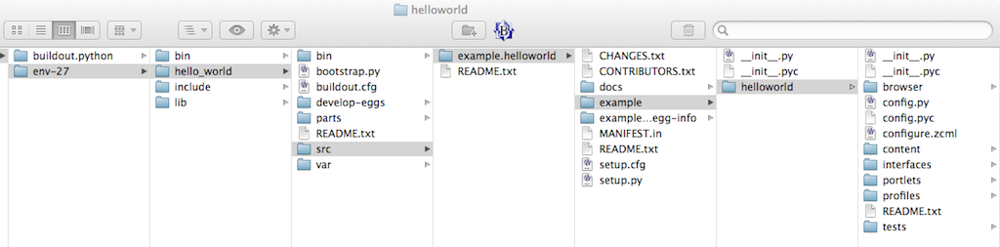

----------------------
Files and Directories
----------------------

Before we start writing code, I want to review some important files and directories. In the examples above, we created the **hello_world** directory that contains our Plone installation. We sometimes refer to it as the **buildout** directory. It contains the **buildout.cfg** file. 

We also created an add-on package named **example.helloworld**. It contained the **example** directory which contained the **helloworld** directory. We referred to the *helloworld* directory as the **product directory**. Among other things, the *product directory* contains the **browswer** directory. Many of the changes in our examples happen in the *browser* directory.

