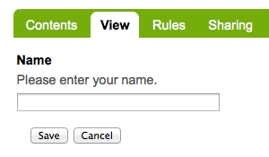
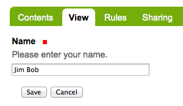
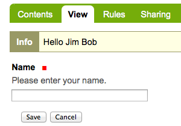
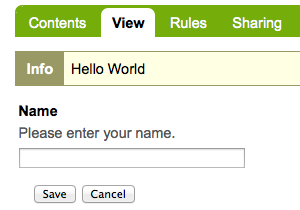

==================
Add a simple form
==================

.. admonition:: Description

A simple tutorial introducing the basics of Plone development.

.. contents:: :local:

There are two steps to building a simple form; registering the form in **configure.zcml**, and writing the Python code to handle the form. 

Register the form
==================

We'll call our form page **hello_world_form**. We need to register it in a configure.zcml file.

- Edit the **configure.zcml** file in the **browser** directory. Open *configure.zcml* in your favorite editor and add this just before the closing </configure> tag.::

    <browser:page
        name="hello_world_form"
        for="*"
        class=".hello_world_form.HelloWorldFormView"
        permission="zope2.View"
        />

.. Note::

    - We use the **name** attribute to access the form.
    - The asterisk in the **for** attribute allows this form to be called in any context, or with any interface. 
    - The **class** attribute defines a **HelloWorldFormView** view class in a file called **hello_world_form.py**. This class is used when our form is accessed.
    - The **permission** attribute allows us to limit access to our form. In this case, we give everyone permission.
    

Our entry uses the **browser** prefix, so we need to define it in configure.zcml before we can use it. 

- Add **xmlns:browser="http://namespaces.zope.org/browser"** at the top of configure.zcml so it looks something like::

    <configure
        xmlns="http://namespaces.zope.org/zope"
        xmlns:browser="http://namespaces.zope.org/browser"
        i18n_domain="example.helloworld">

When we are done, configure.zcml should look something like this.::

    <configure
        xmlns="http://namespaces.zope.org/zope"
        xmlns:browser="http://namespaces.zope.org/browser"
        i18n_domain="example.helloworld">
    
      <include package="plone.app.contentmenu" />
    
      <!-- -*- extra stuff goes here -*- -->
    
        <!-- this is our simple form -->
        <browser:page
            name="hello_world_form"
            for="*"
            class=".hello_world_form.HelloWorldFormView"
            permission="zope2.View"
            />
    
    </configure>

Python code
============

Now we need to create the code to handle our form. 

- create the file *hello_world_form.py* in the *browser* directory.::

    touch hello_world_form.py
    
Open the *hello_world_form.py* file in your favorite editor and add the following code.

- Define our form field in an interface.

    The imports::

        from zope.interface import Interface
        from zope.schema import TextLine
        from zope.i18nmessageid import MessageFactory
        _ = MessageFactory('hello_world')
        
    The interface::

        class IHelloWorldForm(Interface)\:
        
            hello_world_name = TextLine(
                title=_(u'Name'),
                description=_(u'Please enter your name.'),
                required=False)

This defines a TextLine field with an id of **hello_world_name**. The title and description will show up on the form. It is not a required field.
    

- Create a class for our logic. This is used when our view is accessed.

    The imports::

        from Products.statusmessages.interfaces import IStatusMessage
        from z3c.form import button
        from z3c.form import form, field
    
    The class::

        class HelloWorldForm(form.Form)\:
        
            fields = field.Fields(IHelloWorldForm)
            ignoreContext = True
        
            def updateWidgets(self):
                super(HelloWorldForm, self).updateWidgets()
        
            @button.buttonAndHandler(u'Save')
            def handleSave(self, action):
                data, errors = self.extractData()
                if errors:
                    return False
        
                if data['hello_world_name'] is not None:
                    hello_name = data['hello_world_name']
                else:
                    hello_name = 'World'
        
                IStatusMessage(self.request).addStatusMessage(
                    "Hello %s" % hello_name, 
                    'info')
                redirect_url = "%s/@@hello_world_form" % self.context.absolute_url()
                self.request.response.redirect(redirect_url)
        
            @button.buttonAndHandler(u'Cancel')
            def handleCancel(self, action):
                IStatusMessage(self.request).addStatusMessage(
                    "Hello No One",
                    'info')
                redirect_url = "%s/@@hello_world_form" % self.context.absolute_url()
                self.request.response.redirect(redirect_url)

.. Note::

    - We first import the field from our interface above.
    - The **ignoreContext** directive means this form is not meant to be called in the context of an object.
    - We define **updateWidgets** to the same method belonging to our parent.
    - We create 2 button handlers.

The fun parts here are the two button handlers; **handleSave** and **handleCancel**. 

- At the bottom of *hello_world_form.py* we need to use **wrap_form** on our class. This wraps our form in the standard Plone layout, placing our form in the content area. This also creates the view **HelloWorldFormView** referenced in *configure.zcml*.::

    from plone.z3cform.layout import wrap_form
    HelloWorldFormView = wrap_form(HelloWorldForm)

Access the form
================

You can access the form with an url like

    *http://localhost:8080/Plone/@@person*

    

Type in a name and click *Save*, or just click *Cancel*.
    

