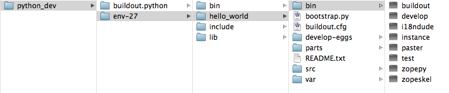

-------------
Quick Review
-------------

Before moving on, lets review what our directory structure lools like. Inside the *python_dev* directory we have *buildout.python* and *env-27*. 

Inside *env-27* we have the **hello_world** directory, our Plone installation. Called the **buildout_directory**, it has the **buildout.cfg** file, and a script in the bin directory named **instance** used to start and stop Plone.

.. Note::

    Now that we have our virtual_env, we won't use *buildout.python* again for these examples. However, you can return there later to create new virtual environments for other Python projects.::
    
         # from the **python_dev** directory
         ./buildout.python/bin/virtualenv-2.7 some_other_env-27
         
    You can also build the versions of Python that we skipped in the Build Python section above, and then use them to build new Python virtual_envs.::

         # from the **python_dev** directory
         ./buildout.python/bin/virtualenv-3.2 some_env-32
