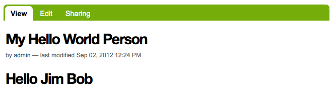
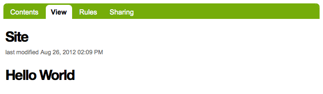

===================
Add a custom view
===================

.. admonition:: Description

A simple tutorial introducing the basics of Plone development.

.. contents:: :local:

In this tutorial we add a browser view. Plone uses views to display dynamic content. 

There are now two ways to add views to Plone; Zope 3 and Grok. This tutorial covers the Zope 3 method. For more information about views, see the :doc:`Views and viewlets </views/index>` section of the developer manual. 

There are 3 parts to our view; a Python class, a page template, and a ZCML configuration. We add two files to the browser directory, and register our view in configure.zcml.

Register the view
==================

- Edit the **configure.zcml** file in the **browser** directory. Open *configure.zcml* in your favorite editor and add this just before the closing </configure> tag.::

    <browser:page
        name="hello_world_view"
        for="*"
        permission="zope2.View"
        class=".hello_world_view.HelloWorldView"
        />

.. Note::

    We use the **name** attribute to access the view.
    The **for** attribute allows us to limit context to a particular interface. With the asterisk, we are not limiting access.
    The **permission** attribute allows us to limit access with a permission. In this case, we have a wide open permission.
    The **class** attribute points to our Python class. Here, we have a **HelloWorldView** class in a file named **hello_world_view.py**. 

- If you have not already done so, you need to define the browser namespace in configure.zcml by adding **xmlns:browser="http://namespaces.zope.org/browser"** to the configure tag. 

If you also went through the :doc:`simple form tutorial </helloworld/form>`, then *configure.zcml* should look something like this when you are done.::

    <configure
        xmlns="http://namespaces.zope.org/zope"
        xmlns:browser="http://namespaces.zope.org/browser"
        i18n_domain="example.helloworld">
    
      <include package="plone.app.contentmenu" />
    
      <!-- -*- extra stuff goes here -*- -->

        <!-- this is our simple form -->
        <browser:page
            name="hello_world_form"
            for="*"
            class=".hello.HelloWorldFormView"
            permission="zope2.View"
            />
        
        <!-- this is our custom view -->
        <browser:page
            name="hello_world_view"
            for="*"
            permission="zope2.View"
            class=".hello_world_view.HelloWorldView"
            />

    </configure>

Create Python class
====================

- We need to create our Python class. In the **browser directory**, create a file named **hello_world_view.py** and add the following code.::

    from Products.Five import BrowserView
    from Products.Five.browser.pagetemplatefile import ViewPageTemplateFile
    
    class HelloWorldView(BrowserView):
    
        template = ViewPageTemplateFile('hello_world_view.pt')
    
        def __call__(self):
            """"""
            self.hello_name = getattr(self.context, 'hello_name', 'World')
            return self.template()
    

We use the **template** attribute to register our page template **hello_world_view.pt**. 

The __call__() method is the entry point for executing view code. In it, we add a **hello_name** attribute to the view. Our page template will use the value of hello_name when the page is rendered.

The logic in our class is pretty simple. If our context has a hello_name attribute, then we use its value in our view. If context does not have a hello_name attribute, we use the string 'World'.

Create page template
=====================

The third part of our view is the page template. 

- In the browser directory, create a file named **hello_world.pt** and add the following::

    <html xmlns="http://www.w3.org/1999/xhtml"
          xmlns:metal="http://xml.zope.org/namespaces/metal"
          xmlns:tal="http://xml.zope.org/namespaces/tal"
          metal:use-macro="context/main_template/macros/master">
    
        <metal:block fill-slot="content-core">
            

                <h1>Hello 
                    this gets replaced
                </h1>
            

        </metal:block>
    
    </html>

Plone uses Zope Page Templates (ZPT). For great documentation on ZPT and the TAL, TALES, and METAL languages, see the :doc:`TAL page templates </templates_css_and_javascripts/template_basics>` section of the developer manual, and the 
`TAL/TALES & METAL Reference Guide <http://www.owlfish.com/software/simpleTAL/tal-guide.html/>`_

In the above code, we define some xml namespaces; **metal** and **tal** that we use in our template.::

    xmlns:metal="http://xml.zope.org/namespaces/metal"
    xmlns:tal="http://xml.zope.org/namespaces/tal"

The **metal:use-macro** statement tells ZPT to use **main_template** to draw our page.::

    metal:use-macro="context/main_template/macros/master"

The master template *main_template* contains predefined **slots**, or areas on the page, that we can fill with content from our template.

Anything between the::

    <metal:block fill-slot="content-core">
    
and::

    </metal:block>
    
tags is displayed in the **content-core** area of our page.

We also have access to the attributes of our view class in the **view** namespace. In our case, we are interested in **view/hello_name**.::

    this gets replaced
    
In our Python class, we defined a hello_name attribute. This code says take the value of the hello_name attribute and use it as the content for the span tag. So, the string "this gets replaced"" does in fact get replaced.

Access the view
================

To access the view, add @@hello_world_view to the end of an object url in your plone site.::

    http://localhost:8080/Plone/a-hello-world-object/my-hello-world-person/@@hello_world_view
    
Since our object has a *hello_name* attribute, the value is displayed along with the word *Hello*.

We can also call our view on the root of the site.::

    http://localhost:8080/Plone/@@hello_world

The root of the site does not have a *hello_name* attribute, so *Hello World* is displayed.

For a more in depth explanation of views, see the :doc:`Views and viewlets </views/index>` section of this manual.

